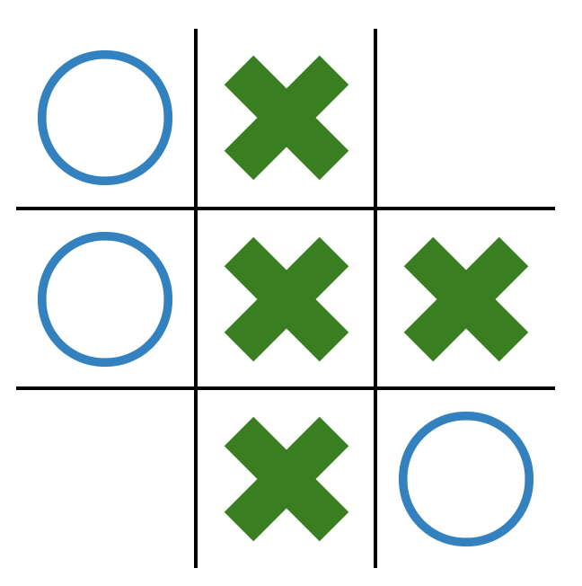

# How to create a simple TicTacToe Agent using Neural Networks

In this repo we'll go over the creation of an intelligent agent that is able to play the game of TicTacToe in an intelligent way. We will use **Value Function Approximation** (VFA) to assign values to each state that is encountered during an episode, and the agent will choose the action that leads to the state with the highest value. The VFA model will be a **Deep Neural Network** trained on samples generated by **Monte Carlo** simulations. Solving TicTacToe can be done in much simpler ways, without the need of VFA, but I wanted to show how it can be done using these techniques, so that later the same algorithm can be applied in more complex settings.

---
## Overview of an MDP

In most of this walkthough we are going to assume that the intelligent agent takes the role of Player 1 (X), but all the concepts presented here also apply for creating an intelligent Player 2 (O). In fact, this framework will allow us to switch between these two possibilities by only modifying two lines of code, and even use it on environments other than TicTacToe.

Reinforcement Learning generally uses [Markov Decision Processes](https://en.wikipedia.org/wiki/Markov_decision_process) (MDPs) to formulate its problems. 


Basically, they consist of an **agent** that interacts with an **environment**. In our case, the agent is the Player 1 (X) and the environment is everything else in the game, including the opponent. The agent can receive information about the current state of the environment, which we call **state**. This is essentially a representation of the environment at a specific moment of time. We will represent the state as a vector of nine numbers, where a 1 corresponds to a cell where there's an X, a -1 corrresponds to a cell where there's an O and 0 corresponds to an empty cell. Hence, this is how the following board configurations will be represented:


We denote the state space by , where .

Given one of these vectors, the agent will choose the **action** that it finds most appropiate. It must take into account that the action it chooses will influence the environment and thus, the sequence of future states. Actions are represented by the numbers 0 to 8, according to each position of the board, 0 being the upper left corner, 2 the upper right corner, 6 the bottom left corner and 8 the bottom right corner. We denote the action space by , where . Note that the full action space will only be available to the agent when the board is empty, i.e. the vector of all zeros.

Lastly, MDPs also present the concept of **rewards**. These are numerical values that are given to the agent after it performs an action. A low value of a reward means that the action selected was not good, while a high value shows the opposite. Therefore, this is how we will indicate the agent that it has to win at the game: we will give it a reward of 1 when it wins and a reward of -1 when it loses, and it will try to maximize this value. If the game hasn't ended or there is a tie, the reward will be 0.


MDPs are dynamic, meaning that they evolve over time. Hence, we have a sequence of states, actions and rewards for each episode that occurs (an episode is a fancy word for game). At the very first timestep, denoted by , we observe the state , take the action  according to that state, and receive the reward  as a consequence of that action. Then we will land on the state  and repeat the cycle, until we reach a state that is terminal.

---
## Evaluating Afterstates

Now that we know how to represent states, actions and rewards, we have to figure out a way to map states into actions. That is, given 9 numbers that represent a specific state, the agent must output a single number (0 to 8) with its desired action.

We will do this by evaluating afterstates and choosing the best one. An afterstate is the representation of the board right after the agent has made its move, but before the opponent has. This solves the issue of trying to estimate the environment's dynamics: when the agent chooses an action, it doesn't know what the next state will be (because the next state depends on the opponent's move), but it does know what the afterstate will be.

Given the state we can consider three different afterstates, each resulting after one of the possible actions:




Now image there's an oracle that tells us how good is an afterstate by giving it a value between -1 and 1, where the closest it is to 1, the more likely is the agent to win and viceversa. Once we have that oracle (or an approximation of it) our agent will choose the action that takes it to the afterstate with the highest value. On the next sections we will see how to create this oracle by trial and error.

---
## Creating the Environment
Enough with the theory and let's get into some coding. Most of the functions here will be incomplete and I will just show the skeleton of the program, but all of the code can be found on the project's repo.

Let's start by creating the environment:

```python
class TicTacToe:

    def __init__(self):
        self.grid = np.array([0, 0, 0, 0, 0, 0, 0, 0, 0])
        self.turn = 1

    def play(self, action):
        self.grid[action] = self.turn
        self.turn *= -1

    @property
    def current_state(self):
        return tuple(self.grid)

    def get_action_space(self, state):
        return list(np.where(np.array(state) == 0)[0])

    def get_afterstate(self, state, action, turn):
        grid = np.array(state)
        grid[action] = turn
        return tuple(grid)

    def get_reward_player1(self, grid=None):
        ...

    def reset(self):
        ...
```
Firstly, on  `__init__` we initialize the grid / board of the game as a 9-dimensional array of zeros. We also create the variable turn, which corresponds to 1 if it's Player 1's turn and -1 otherwise. The method `play` takes care of modifying the grid given an action and flipping the turn.

Then, `current_state` returns the 9-dimensional vector of the board's state as a tuple, and `get_action_space` returns a list of all the possible actions given a state.

Moving on, `get_after_space` will return a representation of an aftestate as a tuple given a state, an action, and a turn (basically it simulates a move and returns the position of the board right after it's played).

Finally, `get_reward_player1` Returns 1 if Player 1 has won, -1 if it has lost, 0 if there's a tie, and `None` otherwise. This distinction between 0 and `None` allows us to determine if a state is terminal, but in theory a reward of `None` is still a reward of 0. Note that we only have a reward function for Player 1, that's because the reward for Player 2 is the negative of Player 1's. Additionally, there's a `reset` method used when an episode must be restarted.

---
## Monte Carlo Method

We will use the [Monte Carlo Method](https://en.wikipedia.org/wiki/Monte_Carlo_method) in order to solve for the Value Function, that is, the function that is able to map afterstates (9-dimensional vectors) into scalars between -1 and 1, which tell us how good is each afterstate. This method works by sampling many episodes at random and averaging the rewards that we get for each afterstate encountered.

We'll start by defining the **return** of an aferstate, denoted by  as the **sum of the discounted future rewards**, that is the sum of the sequence of rewards that we obtain from that afterstate onwards. In many applications, the further the rewards are in the future, the less important they become, so we add a discount factor  that gives a lower weight to the more distant rewards.

The return is thus given by , where  is the last timestep of the episode, so to obtain the return for the afterstate chosen at time  we would do the following:  Note that in our case, the reward is always 0 except for the terminal states, so 
. If  our agent will only care about the inmediate reward, and if  it will give the same importance to future rewards as to immediate rewards. In this case we will set  but many other values will work too. 

In order to assign a value to an afterstate we will just use the average of the returns that have been observed on that afterstate over many simulations. If we sample enough episodes, say 100,000; then most of the afterstates will have been visited a large number of times, so the average of the returns will give us a pretty accurate estimate of the true value.

As the number of possible afterstates in TicTacToe is fairly small (between 2000 and 3000 I believe), we can use these estimates as the value function. However, many other problems can have millions or billions of afterstates, so using these estimates can result in very poor behaviour, as they are not very accurate. In these cases we have to use [Value Function Approximation](https://en.wikipedia.org/wiki/Function_approximation), which allows us to generalize and perform well in states that we have seldom visited or not at all.

While it is perfectly valid to use the Monte Carlo estimates as our Value Function in TicTacToe, I will show how we can use Value Function Approximation so that we can apply these techniques to more complex environments.

---
## Creating the Policies
In Reinforcement Learning, a **policy** is a way of behaving, or a mapping from states to actions. What we've been talking about so far is the search for the optimal policy, which is the policy that, given any state of the game, it performs the best action possible.

```python
class RandomPolicy(Policy):

    def sample(self, state):
        return np.random.choice(self.environment.get_action_space(state))


class OneStepPolicy(Policy):

    def sample(self, state):
        actions = self.environment.get_action_space(state)
        random.shuffle(actions)
        best_afterstate_value = float('-inf')
        for action in actions:
            afterstate = self.environment.get_afterstate(state, action, self.turn)
            afterstate_value = (self.environment.get_reward_player1(
                grid=np.array(afterstate)) or 0) * self.environment.turn

            if afterstate_value > best_afterstate_value:
                best_action = action
                best_afterstate_value = afterstate_value
        return best_action


class HumanPolicy(Policy):

    def sample(self, state):
        ...
        return int(input('Input your action'))
```

Here we create three policies, and as can be observed, they all inherit from `Policy` and have a method `sample`, which takes a state as an input an returns an action.

Firstly, `RandomPolicy` just takes an action at random from the possible ones. `OneStepPolicy` is a bit smarter, as it is able to look one move ahead and evaluate the afterstates obtained by each action, so if it has an immediate winning move, it will take it. This can be thought of as one step of the Minimax Algorithm. Lastly, `HumanPolicy` takes user input (which must be a number in the action space) and returns it.

On the next section we will create the agent's policy, which will take advantage of Monte Carlo and VFA.

---
## VFA and Deep Learning
In order to perform VFA, we need a function  that maps the 9-dimensional afterstate vector into a value between 0 and 1: .

One option would be to use a Linear VFA given by , where  is the 9-dimensional vector representing the afterstate and  is a weight vector. However, the scope of functions that can be represented using this model is very limited, so we will use an [Artificial Neural Network](https://en.wikipedia.org/wiki/Artificial_neural_network) instead. I will not go into the details of ANNs but what's important to know is that they can map 9-dimensional vectors into scalars using very complex representations.

```python
class NeuralNetwork:

    def __init__(self, *layers, alpha=.01):
        ...

    def predict(self, x):
        return np.asscalar(forward_prop(self.W, self.b, x))

    def gd_step(self, x, v_target):
        W_gradients, b_gradients = backprop(self.W, self.b, x, v_target)
        for i in range(self.n_layers):
            self.W[i] = self.W[i] - self.alpha * W_gradients[i]
            self.b[i] = self.b[i] - self.alpha * b_gradients[i]

    def save_weights(self, name):
       ...

    def load_weights(self, name):
        ...
```

A basic Neural Network is composed of a set of parameters, denoted by  and , and a learning rate . The function `predict` takes in an afterstate `x`, represented by a 9-dimensional vector, and returns the value that the ANN predicts for that afterstate. The method `gd_step` performs one step of [Gradient Descent](https://en.wikipedia.org/wiki/Gradient_descent#:~:text=Gradient%20descent%20is%20a%20first,function%20at%20the%20current%20point.), which in theory improves the parameters and  so that they will make better predictions in the future. This is referred to as *training*. `gd_step` takes as input `x` and `v_target`, where `x` is a collection of afterstates and `v_target` is a collection of their corresponding values, which have been previously calculated through Monte Carlo. Basically we want our Neural Net to make predictions as similar as possible to the values given by Monte Carlo, as we consider those to be correct.

In order to perform the prediction and the gradient descent steps we make use of two more functions, which have been written entirely in NumPy:

```python
def forward_prop(W_list, b_list, x):
    #We use tanh as the activation function for all layers
    for W, b in zip(W_list, b_list):
        x = np.tanh(np.dot(W, x) + b)
    return x

def backprop(W_list, b_list, x, v_target):
    ...
    return grad_W[::-1], grad_b[::-1]
```

We are now ready to implement the agent's policy, which will implement the Neural Network.

```python
class NeuralNetPolicy(Policy):

    def __init__(self, env, hidden_layers, name='', alpha=.01, gamma=.95, turn=1):
        super().__init__(env, turn=turn)
        self.afterstate_values = {}
        self.afterstate_visits = {}
        self.states_actions_rewards = []
        self.epsilon = epsilon
        self.gamma = gamma
        self.model = NeuralNetwork(self.environment.state_dimension, *hidden_layers, 1, alpha=alpha)
        self.name = name

    def sample(self, state):
        actions = self.environment.get_action_space(state)
        random.shuffle(actions)
        best_afterstate_value = float('-inf')
        for action in actions:
            afterstate = self.environment.get_afterstate(state, action, self.turn)
            afterstate_value = self.model.predict(
                np.array(afterstate, dtype=np.float64).reshape([self.environment.state_dimension, 1]))
            if afterstate_value > best_afterstate_value:
                best_action = action
                best_afterstate_value = afterstate_value
        return best_action

    def collect(self, state, action, reward):
        self.states_actions_rewards.append((state, action, reward))

    def update(self):
        G = 0
        for state, action, reward in reversed(self.states_actions_rewards):
            G = reward + self.gamma * G
            afterstate = self.environment.get_afterstate(state, action, self.turn)
            old_value = self.afterstate_values.get(afterstate, 0)
            no_visits = self.afterstate_visits.get(afterstate, 0) + 1
            self.afterstate_visits[afterstate] = no_visits
            new_value = old_value + (1/no_visits) * (G - old_value)
            self.afterstate_values[afterstate] = new_value

        self.states_actions_rewards = []

    def update_gradient(self):
        X = np.array(list(self.afterstate_values.keys()), dtype=np.float64)
        Y = np.array(list(self.afterstate_values.values()))

        self.model.sgd_step(X.T, Y)
```
Let's go over it step by step.

The `sample` method has the same use as in the other policies: it takes in a state and returns an action. It firstly obtains the list of the possible actions and shuffles them. Then, it samples each afterstate that can be obtained and predicts its value using the Neural Net. It keeps track of which afterstate has yielded the greatest value and returns the action that leads to that afterstate. At first, the Neural Net won't make very good predictions, so the values of the afterstates will be messed up and won't make any sense,but the idea is that with time and thanks to the training, these predictions get better and better.

The `collect` method is invoked on every timestep and takes care of storing each state that has been encountered, the action that was taken, and the rerward that was obtained. On the other hand, `update` is invoked when the episode finishes and it calculates the returns obtained for each afterstate visited on that episode. It then updates the previous estimates of the afterstate values given these newly observed returns (using Monte Carlo).

Lastly, `update_gradient` is invoked every 100 episodes (although we could invoke it every episode or every 1000 episodes) and takes care of training/improving the Neural Net using the afterstate value estimates obtained by Monte Carlo.


---
## Putting it all together

Finally we have to create a function that is able to generate many game simulations in a dynamic manner:
```python
def train(env, p1, p2, eps_for_update, total_iters):

    for i in range(total_iters):

        for _ in range(eps_for_update):

            first_iter = True
            while True:
                p1_state = env.current_state
                p1_action = p1.sample(p1_state)
                env.play(p1_action)
                # Check if the move player1 did leads to a terminal state
                p1_reward = env.get_reward_player1()
                if p1_reward is not None:  # If the reward is None, then the game has not ended
                    win_ratio_metrics.register_win(p1_reward)
                    p1.collect(p1_state, p1_action, p1_reward)
                    p2_reward = p1_reward * (-1)
                    p2.collect(p2_state, p2_action, p2_reward)
                    break

                if not first_iter:
                    p2.collect(p2_state, p2_action, 0)
                else:
                    first_iter = False

                p2_state = env.current_state
                p2_action = p2.sample(p2_state)
                env.play(p2_action)
                p1_reward = env.get_reward_player1()
                p1.collect(p1_state, p1_action, p1_reward or 0)
                # Here we check if the move player2 did leads to a terminal state
                if not p1_reward is None:
                    win_ratio_metrics.register_win(p1_reward)
                    p2_reward = p1_reward * (-1)
                    p2.collect(p2_state, p2_action, p2_reward)
                    break

            p1.update()
            p2.update()
            env.reset()

        if hasattr(p1, 'update_gradient'):
            p1.update_gradient()
        if hasattr(p1, 'model'):
            p1.model.save_weights(p1.name)
        if hasattr(p2, 'update_gradient'):
            p2.update_gradient()
        if hasattr(p2, 'model'):
            p2.model.save_weights(p2.name)
```
This function takes in an environment, two players (which are instances of Policy), `eps_for_update`, which is how many episodes we have to simulate in order to perform one step of gradient descent and `total_iters`, which contains how many iterations of gradient descent we will perform. Hence, the total number of episodes that are simulated is `eps_for_update` * `total_iters`. This framework allows us to play between different policies for the different players. If we want to train an intelligent agent that plays as Player 1 (X), the argument `p1` of the function must be a `NeuralNetPolicy`, but if we want to do the samething for Player 2(O), we instead pass a `NeuralNetPolicy` to `p2`. As easy as that! We can even have them play against themselves by having two `NeuralNetPolicy`s (although that could lead to some problems since the policy is greedy).

From my observations, optimal behaviour for both players is obtained from either playing against a `RandomPolicy` or against a `OneStepPolicy`. `OneStepPolicy` is way slower, but it enables us to see how the agent learns, obtaining a very low win rate at the beginning and very high at the end.

---
## Analysis and Conclusion
When designing these models we can have many different configurations that we can tweak in order to boost performance. In this case, as we are using a neural network, the main components that we can modify are:
* The number of layers in the network.
* The number of neurons per layer.
* The learning rate 
* The number of episodes until a gradient descent update is performed.
* The number of gradient descent updates.

Taking advantage of Python's multiprocessing, I created a program that can fire multiple instances of `train` at the same time, using different configurations of the parameters for each of them, in order to know which is the most optimal.

The reinforcement learning agent will be Player 2 (O), while Player 1 (X) will be a `OneStepPolicy`, so it makes sense that Player 1 wins more often at the beginning but its win rate decreases as Player 2 gains experience and learns to block Player 1. Below I plotted the win rate of Player 1 for some combinations of the parameters:


Looking at the names of each plot on the legend, I have used the following notation: `ttt_player2_l2_n8_a0.01_e100_i1000` means that, for that configuration, I have used a Neural Net with 2 layers, 8 neurons per layer, a learning rate of 0.01, performed one step of gradient descent after 100 episodes and performed 1000 steps of gradient descent. Logically, those configurations with a value of e of 10, instead of 100, will be trained on one tenth of the episodes. For many configurations we ended up with a Player 1 win rate of 0 or very close to 0. This is remarkable, since Player 1 is not using a completely random policy, but a policy that will take a win if it's possible on the next move.

From this data we can reach many conclusions:

* The size of the network (number of layers and neurons per layer) is not that important, as we obtained good results for all of them. Maybe 2 layers and 8 neurons was too small, but it still performed decently.
* The learning rate is not that important either, but better results are obtained with 0.001 instead of 0.01.
* When performing a gradient descent update after only 10 episodes, we seem to be changing the network too much, and that makes us obtain those spikes that have a "high volatility". In order to get around this we could have tried combining it with a much lower value of the learning rate. When performing gradient descent updates after 100 episodes, we get a curve that is much more stable and slowly decreasing, which is what we are after. On future versions it's probably worth trying 1000 episodes.
* The total number of gradient descent updates always seem to help, getting a steady decrease both for e=10 and e=100.
* On one occasion, `ttt_player2_l5_n32_a0.01_e100_i1000`, the opponent's win rate seemed to be decreasing and then it suddenly increased to 70% and wandered about that number until the end of the training. These events are not rare in Deep Learning, and it probably means that the algorithm got stuck in a local optimum. If we performed training again with the same configuration, it would probably converge to a much better optimum, as the others did. We have to take into account the randomness involved in training, which on some occasions can lead us to bad local optima, such as in this case. This randomness is caused by the initialization of the Neural Net's weights and the sequence of episodes simulated by Monte Carlo, which is obviously different every time.

After observing this conclusions we could try to run another sweep of parameters, but this time focusing more on the learning rate, or in the number of episodes for a GD update; instead of on the network size, which as we have seen is not that relevant. For further optimizations, we could implement -greedy action selection or exploring starts if the trainable agent is Player 1 (X). Additionally, decaying the learning rate over time can help in the convergence of gradient descent.

We have now finished this walkthrough. If you have made it this far, I can only congratulate you. It's unfortunate that I can't provide better explanations for some of it, specially the Deep Learning part, but there are whole books written on the subject and my objective was to write a short guide providing intuition. I hope you enjoyed it and gained some new insight.

All the code, including metrics and analytics, can be found on the project's repo. If you want to test it, you can train your own network using `train.py` and later play against it using `play.py`. I have already trained two networks for each of the agents, called `player1` and `player2`.

For any questions or suggestions don't hesitate to reach me on [carlospita2001@gmail.com](carlospita2001@gmail.com).

---
## Extra: Optimality and Self-play
If you have tested the models inside the data folder that I have trained myself, called *player1* and *player2*, you will notice that they make the right decision most of the times, but not always. Hence we have not achieved optimality. When using neural networks, finding the global optimum is not an easy task, and usually this does not matter as long as the predictions are fairly accurate. There are many techiniques for improving performance which may well have helped here to obtain optimal behaviour. Examples of this techniques include regularization or sophisticated learning algorithms such as [Adam](https://arxiv.org/pdf/1412.6980.pdf). These could have been easily implemented using packages like [Tensorflow](https://www.tensorflow.org/), but I wanted to show how far we could get using Numpy and creating the math ourselves, without relying on third-party implementations that seemlessly make it work. This way we can check that the math actually works and there's no magic going on behind Tensorflow.

Both agents usually obtained over 95% win rate on the last iterations of training when playing against a `OneStepPolicy`, after starting with win rates well below 50% (recall that `OneStepPolicy` can look one step ahead); so overall I take this as a success.

The training was done in both cases against a `OneStepPolicy`, and self-play didn't lead to any real improvements. When comfronting two `NeuralNetPolicy`s against each other, I had to use an epsilon-greedy action selection in order to get some stochasticity. This means that every time an action had to be chosen, there was a small probability(which decayed over time) to select a random action. Without epsilon-greedy, the same episode would be played over and over again. 

Using this exploratory technique, the games would sometimes converge to a total domination by Player 1 and other times to a total domination by Player 2, obtaining a 100% win rate. Once this total domination was estabilished, there was no way out, as the probability of choosing random actions had decayed to a very small value and hence the games would always develop the same way. I also tried to alternate learning so that each 1000 episodes only one of the agents would perform gradient descent, but this didn't work either.

Finally, I loaded the model that was already trained as Player 1 (which played pretty well but not optimally) and trained a `NeuralNetPolicy` against it. I disabled learning for Player 1 so that its policy wouldn't change. At first, Player 2 lost 95-100% of the time, but over time, it learned to exploit Player 1's weakness and ended up winning every time. This was because the same episode was being played out every time, and Player 2 was making the exact sequence of moves that made Player 1 lose. As a human, finding this sequence (or sequences) would have been rather had, since most of the time Player 1 made the correct moves (recall it obtained 95%+ win rate against a `OneStepPolicy`), but the opposing `NeuralNetPolicy` was able to exploit it. However, it didn't end up being a good player, since it only knew how to play against this neural network and hadn't been able to generalize due to its deterministic action selection.

Let me know your thoughts on optimality and how self-play could have been implemented successfully!
